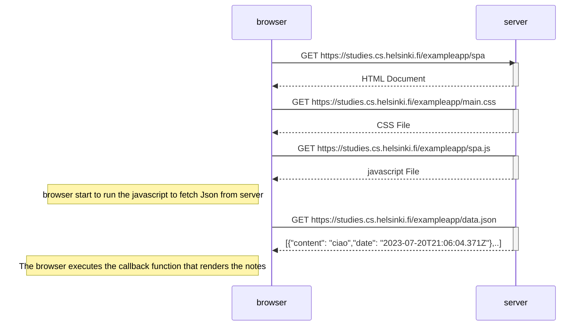

```mermaid
sequenceDiagram
    participant browser
    participant server

    browser->>server:GET https://studies.cs.helsinki.fi/exampleapp/spa
    activate server
    server-->>browser: HTML Document
    deactivate server

    browser->server:GET https://studies.cs.helsinki.fi/exampleapp/main.css
    activate server
    server-->>browser: CSS File
    deactivate server

    browser->server:GET https://studies.cs.helsinki.fi/exampleapp/spa.js
    activate server
    server-->>browser: javascript File
    deactivate server

    note left of browser:browser start to run the javascript to fetch Json from server

    browser->server:GET https://studies.cs.helsinki.fi/exampleapp/data.json
    activate server
    server-->>browser:  [{"content": "ciao","date": "2023-07-20T21:06:04.371Z"},..]
    deactivate server

    Note left of browser: The browser executes the callback function that renders the notes
```
